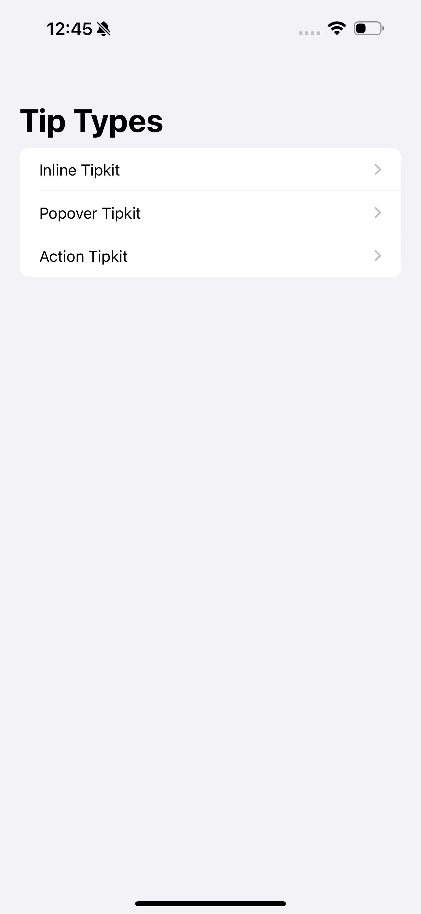
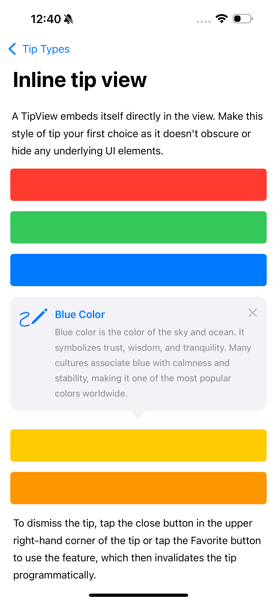
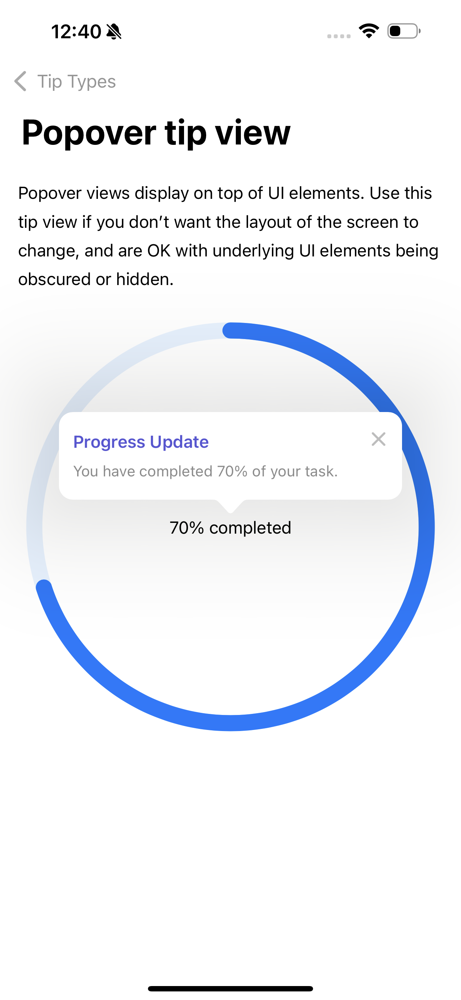
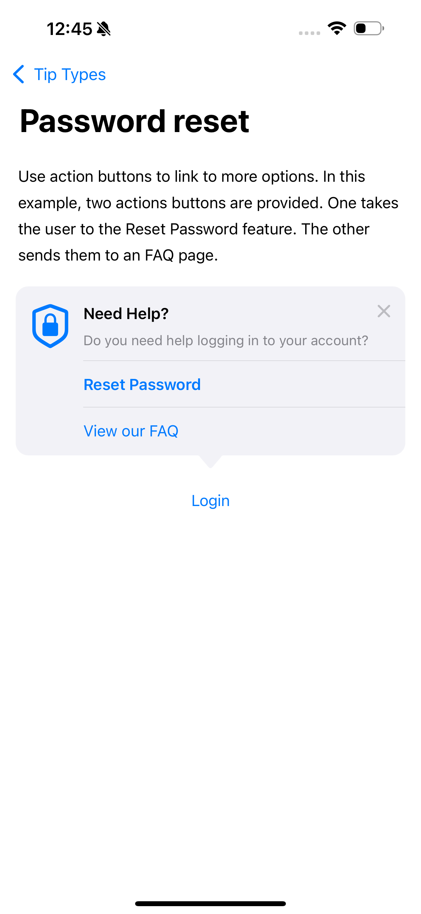

# TipKitExample
This sample project demonstrates the implementation of TipKit, introduced at WWDC 2023. TipKit provides a walkthrough-style UI that helps highlight new features within an application. It allows developers to create contextual tips, guiding users through new functionalities in an intuitive and engaging way.

---------

## **Screenshots**
<table align="center">
  <tr>
    <td></td>
    <td style="width: 50px;"></td>
    <td></td>
  </tr>
   <tr>
    <td></td>
    <td style="width: 50px;"></td>
    <td></td>
  </tr>
</table>
